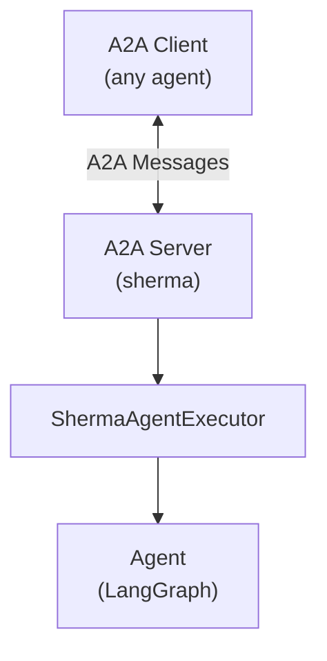

# A2A Integration

sherma is built on the [A2A (Agent-to-Agent) protocol](https://a2a-protocol.org/) as its agent communication layer. Every sherma agent speaks A2A natively, making it interoperable with any A2A-compatible agent regardless of the framework it was built with.

## Architecture



## ShermaAgentExecutor

`ShermaAgentExecutor` is the bridge between the A2A server protocol and sherma's `Agent` interface. It implements the A2A SDK's `AgentExecutor` interface.

```python
from sherma.a2a import ShermaAgentExecutor

executor = ShermaAgentExecutor(agent)
```

### What it does

1. **Task management** -- Creates an A2A task for each new conversation. Uses `TaskUpdater` to manage task state transitions.
2. **Message forwarding** -- Passes A2A messages to `agent.send_message()` and processes the response stream.
3. **Schema validation** -- If the agent declares `input_schema` or `output_schema`, validates incoming/outgoing `DataPart` messages against those schemas.
4. **Event routing** -- Handles different response types:
   - `Message` -- completes the task with the response
   - `Task` -- logs the initial task event
   - `TaskArtifactUpdateEvent` -- forwards artifacts to the task updater
   - `TaskStatusUpdateEvent` -- updates task status (including `input_required` for interrupts)

### Task lifecycle

```
New message → create Task → start_work → send_message → process events → complete/cancel
```

If no events are received from the agent, the task completes with no message.

## Serving an Agent

To expose a sherma agent as an A2A HTTP server:

```python
from a2a.server.apps import A2AStarletteApplication
from a2a.server.request_handlers import DefaultRequestHandler
from a2a.types import AgentCard, AgentCapabilities

from sherma import DeclarativeAgent
from sherma.a2a import ShermaAgentExecutor

# Create the agent
agent = DeclarativeAgent(
    id="my-agent",
    version="1.0.0",
    yaml_path="agent.yaml",
)

# Wrap in executor
executor = ShermaAgentExecutor(agent)

# Build A2A handler and app
handler = DefaultRequestHandler(agent_executor=executor)
card = AgentCard(
    name="My Agent",
    description="Does useful things",
    url="http://localhost:8000",
    version="1.0.0",
    capabilities=AgentCapabilities(streaming=False),
)

app = A2AStarletteApplication(agent_card=card, http_handler=handler)
# Serve with uvicorn: uvicorn main:app
```

## Calling Remote Agents

Use `RemoteAgent` to call any A2A-compatible agent:

```python
from sherma import RemoteAgent

remote = RemoteAgent(
    id="external-agent",
    version="1.0.0",
    url="https://agent.example.com",
)

# Register in agent registry for use in declarative agents
from sherma import AgentRegistry
from sherma.registry.base import RegistryEntry
from sherma.types import Protocol

registry = AgentRegistry()
await registry.add(RegistryEntry(
    id="external-agent",
    version="1.0.0",
    remote=True,
    url="https://agent.example.com",
    protocol=Protocol.A2A,
))
```

The remote agent uses the A2A Python SDK's client under the hood. It doesn't matter what framework the remote agent was built with -- any A2A-compatible agent works.

## Message Conversion

sherma provides lossless bidirectional conversion between A2A and LangGraph message formats.

### A2A to LangGraph

```python
from sherma.messages.converter import a2a_to_langgraph

lg_messages = a2a_to_langgraph(a2a_message)
# Returns list[BaseMessage] (HumanMessage or AIMessage)
```

- A2A `TextPart` becomes string content
- A2A `DataPart` becomes a structured content block with type, data, and metadata
- A2A `Role.user` maps to `HumanMessage`, `Role.agent` to `AIMessage`
- Message ID, task ID, and context ID are preserved in `additional_kwargs["a2a_metadata"]`

### LangGraph to A2A

```python
from sherma.messages.converter import langgraph_to_a2a

a2a_message = langgraph_to_a2a(lg_message)
# Returns A2A Message
```

- String content becomes `TextPart`
- Structured content blocks are converted back to their A2A `Part` type
- Metadata is restored from `additional_kwargs`

## Input/Output Schemas

Agents can declare typed input and output schemas using Pydantic models:

```python
from pydantic import BaseModel
from sherma.langgraph.agent import LangGraphAgent

class WeatherInput(BaseModel):
    city: str
    units: str = "metric"

class WeatherOutput(BaseModel):
    temperature: float
    description: str

class MyAgent(LangGraphAgent):
    input_schema = WeatherInput
    output_schema = WeatherOutput
```

### How schemas work

1. **Agent card** -- `get_card()` automatically injects the JSON schemas as A2A extensions with URIs `urn:sherma:schema:input` and `urn:sherma:schema:output`
2. **Validation** -- `ShermaAgentExecutor` validates incoming `DataPart` messages marked with `agent_input: true` against `input_schema`, and outgoing messages marked with `agent_output: true` against `output_schema`
3. **Helpers** for creating and extracting schema-typed messages:

```python
from sherma import (
    create_agent_input_as_message_part,
    get_agent_input_from_message_part,
    create_agent_output_as_message_part,
    get_agent_output_from_message_part,
    SCHEMA_INPUT_URI,
    SCHEMA_OUTPUT_URI,
)

# Create an input message
msg = create_agent_input_as_message_part(
    WeatherInput(city="Tokyo"),
    SCHEMA_INPUT_URI,
)

# Extract typed input from a message
weather_input = get_agent_input_from_message_part(msg, WeatherInput)
```

## Interrupts

When a LangGraph agent enters an interrupted state (e.g., via an `interrupt` node in a declarative agent), sherma:

1. Detects the `__interrupt__` key in the graph result
2. Creates an A2A `TaskStatusUpdateEvent` with state `input_required`
3. The interrupt value is sent as the status message

When the client sends a follow-up message, graph execution resumes from the interrupt point.
